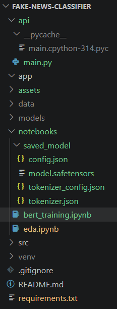
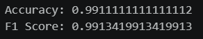
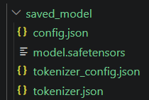
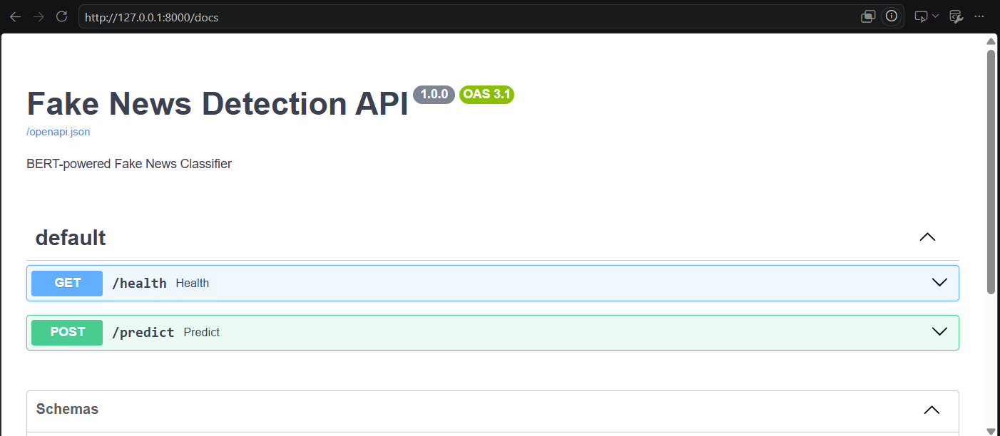
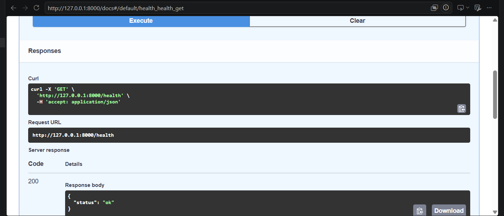
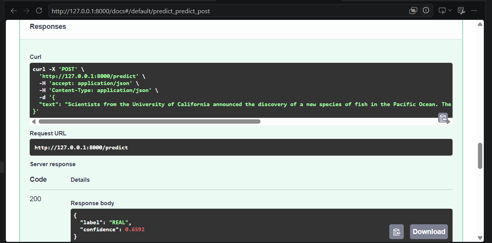

# Fake News Detection Using BERT


A machine learning project that detects whether a news article is **REAL** or **FAKE** using a fine-tuned **BERT (Bidirectional Encoder Representations from Transformers)** model. The project includes exploratory data analysis, baseline modeling, transformer fine-tuning, model evaluation, and deployment through a FastAPI REST API.

## Project Overview

The objective of this project is to build a robust fake news classification system capable of distinguishing between genuine and misleading news articles.

The workflow includes:

* Exploratory Data Analysis (EDA)
* Baseline TF-IDF + Logistic Regression model
* Fine-tuning a BERT transformer model
* Model evaluation using Accuracy and F1-score
* Saving trained model artifacts
* Deployment through a FastAPI REST API
* Interactive API documentation using Swagger UI

---

## Highlights

- Fine-tuned BERT for fake news classification
- Achieved 99.11% test accuracy
- Achieved 99.13% F1-score
- Built REST API using FastAPI
- Interactive Swagger documentation
- Saved trained model artifacts

## Tech Stack

Python • PyTorch • Hugging Face Transformers • FastAPI • Scikit-Learn • NumPy • Pandas • Docker • Swagger UI

## Dataset

**Dataset:** WELFake Dataset (72,134 news articles)

- Class 0 → FAKE
- Class 1 → REAL

After preprocessing, the data was split into training, validation, and test sets.

---

## Project Structure

```text
fake-news-classifier/
│
├── api/
│   └── main.py
│
├── notebooks/
│   ├── eda.ipynb
│   ├── bert_training.ipynb
│   └── saved_model/
│
├── data/
├── models/
├── assets/
│
├── requirements.txt
├── README.md
└── .gitignore
```

<p align="center">
  
</p>

---

## Baseline Model

Before training BERT, a traditional machine learning baseline was implemented:

**Model:** TF-IDF + Logistic Regression

### Baseline Performance

| Metric              | Score  |
| ------------------- | ------ |
| Validation Accuracy | 95.38% |
| Test Accuracy       | 95.31% |

This baseline served as the benchmark for evaluating transformer-based approaches.

---

## BERT Fine-Tuning

A pre-trained BERT model was fine-tuned on the fake news dataset using Hugging Face Transformers and PyTorch.

### Training Configuration

* Model: bert-base-uncased
* Framework: PyTorch
* Tokenizer: BERT Tokenizer
* Maximum Sequence Length: 256
* Optimizer: AdamW
* Learning Rate Scheduler: Linear Warmup Scheduler
* Batch Training with GPU/CPU Support

---

## Final Model Performance

| Metric | Score |
|----------|----------|
| Accuracy | 99.11% |
| F1 Score | 99.13% |

### Model Performance

<p align="center">
  
</p>

The fine-tuned BERT model significantly outperformed the baseline model, achieving near-perfect classification performance on the test set.

---

## Saved Model Artifacts

The trained model and tokenizer were saved for deployment.

### Saved Model Files

<p align="center">
  
</p>

Saved files:

* config.json
* model.safetensors
* tokenizer.json
* tokenizer_config.json

These artifacts allow the model to be loaded directly without retraining.

---

## Installation

Clone the repository:

```bash
git clone https://github.com/TasniaNitu/fake-news-classifier.git
cd fake-news-classifier
```

Install dependencies:

```bash
pip install -r requirements.txt
```

## Running the API

Start the FastAPI server:

```bash
python api/main.py
```

or

```bash
uvicorn api.main:app --reload
```

Open Swagger UI:

```text
http://127.0.0.1:8000/docs
```

## FastAPI Deployment

The trained model was served through a FastAPI REST API for local inference and testing.

### Interactive Swagger Documentation

<p align="center">
  
</p>

### Endpoints

#### Health Check

GET /health

Response:

```json
{
  "status": "ok"
}
```

### Health Endpoint Response

<p align="center">
  
</p>

#### Prediction Endpoint

POST /predict

Request:

```json
{
  "text": "Scientists from the University of California announced the discovery of a new species of fish in the Pacific Ocean. The researchers said the species was identified during a deep-sea expedition and further studies are underway."
}
```

Response:

```json
{
  "label": "REAL",
  "confidence": 0.6592
}
```

### Example Prediction

<p align="center">
  
</p>

---

## Interactive API Documentation

FastAPI automatically generates Swagger documentation.

After starting the server:

```bash
uvicorn api.main:app --reload
```

Open:

```text
http://127.0.0.1:8000/docs
```

to access the interactive API interface.

---

## Technologies Used

* Python
* Pandas
* NumPy
* Scikit-Learn
* PyTorch
* Hugging Face Transformers
* FastAPI
* Uvicorn
* Matplotlib
* Jupyter Notebook

---

## Results Summary

| Model                        | Accuracy |
| ---------------------------- | -------- |
| TF-IDF + Logistic Regression | 95.31%   |
| BERT (Fine-Tuned)            | 99.11%   |

BERT improved accuracy from 95.31% to 99.11%, representing a gain of 3.8 percentage points over the baseline model.

## Key Achievement

Developed an end-to-end fake news classification system using BERT, improving accuracy from 95.31% (TF-IDF + Logistic Regression) to 99.11%. Built a production-style FastAPI REST API with interactive Swagger documentation and hosted the trained model on Hugging Face for deployment and inference workflows.

## Deployment Note

The trained BERT model is hosted on Hugging Face.

A Render deployment was configured successfully, but the free Render instance (512 MB RAM) could not load the 438 MB BERT model due to memory limitations. The API runs locally and can be deployed on infrastructure with sufficient memory resources.

## Model Repository

The trained BERT model is hosted on Hugging Face:

[Hugging Face Model Repository](https://huggingface.co/TasniaNitu/fake-news-bert)

Model files include:

- config.json
- model.safetensors
- tokenizer.json
- tokenizer_config.json

These artifacts can be loaded directly using Hugging Face Transformers without retraining.