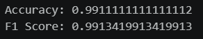
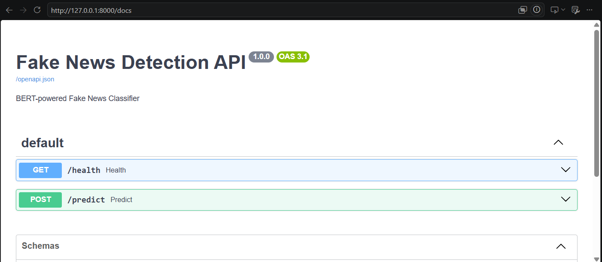

# Fake News Classifier Using BERT


A transformer-based text classification project that predicts whether a news article is **REAL** or **FAKE** using a fine-tuned BERT model.

The project covers exploratory data analysis, traditional machine-learning baselines, BERT fine-tuning, model evaluation, model artifact management, FastAPI inference, Swagger documentation, and Docker containerization.

---

## Key Results

| Model | Test accuracy |
|---|---:|
| TF-IDF + Logistic Regression | 95.31% |
| Fine-tuned BERT | **99.11%** |

The final BERT model achieved:

- **Test accuracy:** 99.11%
- **F1-score:** 99.13%
- **Improvement over baseline:** 3.80 percentage points

These results were measured on the project’s held-out WELFake test split and should be interpreted as benchmark performance rather than guaranteed performance on all real-world news.

---

## Project Overview

The project implements an end-to-end fake-news classification workflow:

1. Explore and preprocess the WELFake dataset
2. Train a TF-IDF and Logistic Regression baseline
3. Fine-tune `bert-base-uncased`
4. Evaluate the final model on held-out data
5. Save the model and tokenizer artifacts
6. Package inference through FastAPI
7. Provide interactive Swagger documentation
8. Containerize the API using Docker
9. Host the trained model artifacts on Hugging Face

---

## Features

- Binary classification: **REAL** or **FAKE**
- Traditional machine-learning baseline
- Fine-tuned BERT transformer
- Accuracy and F1-score evaluation
- Saved model and tokenizer artifacts
- FastAPI REST inference service
- Automatic Swagger/OpenAPI documentation
- `/health` and `/predict` endpoints
- Docker support
- CPU and GPU-compatible training workflow
- Hugging Face model repository

---

## Dataset

The project uses the **WELFake dataset**, containing approximately **72,134 news articles**.

| Label | Meaning |
|---|---|
| `0` | FAKE |
| `1` | REAL |

The data was preprocessed and divided into training, validation, and test sets before model development.

Because very high text-classification scores may sometimes reflect duplicate content, source-specific language, or dataset artifacts, the reported metrics should be interpreted within the context of the WELFake benchmark.

---

## Baseline Model

A traditional machine-learning baseline was trained before BERT fine-tuning.

**Pipeline**

```text
Article text
    ↓
TF-IDF vectorization
    ↓
Logistic Regression
    ↓
REAL / FAKE prediction
```

### Baseline performance

| Metric | Score |
|---|---:|
| Validation accuracy | 95.38% |
| Test accuracy | 95.31% |

This provided a strong benchmark for measuring the value of transformer fine-tuning.

---

## BERT Fine-Tuning

The final classifier was built by fine-tuning:

```text
bert-base-uncased
```

### Training configuration

- **Framework:** PyTorch
- **Library:** Hugging Face Transformers
- **Tokenizer:** BERT tokenizer
- **Maximum sequence length:** 256
- **Optimizer:** AdamW
- **Scheduler:** Linear warmup scheduler
- **Device support:** CPU or GPU
- **Task:** Binary sequence classification

---

## Final Model Performance

| Metric | Score |
|---|---:|
| Test accuracy | **99.11%** |
| F1-score | **99.13%** |

<p align="center">
  
</p>

The fine-tuned BERT model improved test accuracy from **95.31%** to **99.11%**, a gain of **3.80 percentage points** over the baseline.

---

## Architecture

```text
News article
     ↓
BERT tokenizer
     ↓
Token IDs and attention mask
     ↓
Fine-tuned BERT sequence classifier
     ↓
Class probabilities
     ↓
REAL or FAKE prediction
```

---

## Project Structure

```text
fake-news-classifier/
├── api/
│   └── main.py
├── app/
├── assets/
│   └── screenshots/
├── notebooks/
│   ├── eda.ipynb
│   └── bert_training.ipynb
├── .dockerignore
├── .gitignore
├── Dockerfile
├── README.md
├── requirements.txt
└── freeze.txt
```

The trained model is hosted on Hugging Face rather than duplicated inside the Git repository.

---

## Model Repository

The trained BERT model and tokenizer are available on Hugging Face:

[View the Hugging Face model repository](https://huggingface.co/TasniaNitu/fake-news-bert)

Model artifacts include:

```text
config.json
model.safetensors
tokenizer.json
tokenizer_config.json
```

These files allow the classifier to be loaded without retraining.

---

## Installation

### 1. Clone the repository

```bash
git clone https://github.com/TasniaNitu/fake-news-classifier.git
cd fake-news-classifier
```

### 2. Create a virtual environment

```bash
python -m venv venv
```

Activate it on Windows:

```bash
venv\Scripts\activate
```

Activate it on macOS or Linux:

```bash
source venv/bin/activate
```

### 3. Install dependencies

```bash
pip install -r requirements.txt
```

---

## Running the API

Start the FastAPI service:

```bash
uvicorn api.main:app --reload
```

Open the interactive Swagger interface:

```text
http://127.0.0.1:8000/docs
```

<p align="center">
  
</p>

---

## API Endpoints

### Health check

```http
GET /health
```

Example response:

```json
{
  "status": "ok"
}
```

### Prediction

```http
POST /predict
```

Example request:

```json
{
  "text": "Scientists announced the discovery of a new species during a deep-sea expedition."
}
```

Example response:

```json
{
  "label": "REAL",
  "confidence": 0.6592
}
```

The confidence value is the model’s output score and should not be treated as a guaranteed probability of truth.

---

## Example cURL Request

```bash
curl -X POST "http://127.0.0.1:8000/predict" \
  -H "Content-Type: application/json" \
  -d "{\"text\":\"Scientists announced a new discovery after a peer-reviewed study.\"}"
```

---

## Docker

Build the image:

```bash
docker build -t fake-news-classifier .
```

Run the container:

```bash
docker run --rm -p 8000:8000 fake-news-classifier
```

Then open:

```text
http://127.0.0.1:8000/docs
```

---

## Deployment Status

The trained model is hosted on Hugging Face.

A Render deployment was configured, but the free 512 MB instance could not load the approximately 438 MB BERT model within its available memory.

The FastAPI service therefore currently runs locally and can be deployed on infrastructure with sufficient RAM.

---

## Limitations and Responsible Use

- This classifier identifies statistical patterns learned from the WELFake dataset; it does not independently verify whether an article is factually true.
- Results may not generalize to recent events, unfamiliar publishers, satire, opinion pieces, multilingual content, or highly specialized subjects.
- Publisher-specific or formatting-related signals may influence predictions.
- The reported metrics apply to the held-out WELFake test split.
- The model confidence score is not necessarily calibrated.
- Predictions should be combined with source verification and professional fact-checking.
- The system should not be used as the sole basis for content removal, censorship, or reputational decisions.

---

## Future Improvements

- Duplicate and near-duplicate analysis
- Additional leakage checks
- Confusion matrix and class-level metrics
- Probability calibration
- Explainability using SHAP or integrated gradients
- Testing on external fake-news datasets
- Domain-shift evaluation
- DistilBERT or quantized models for lower-memory deployment
- Public API deployment
- Automated tests and continuous integration
- Monitoring for prediction drift

---

## Author

**Kazi Tasnia Nitu**

- GitHub: [github.com/TasniaNitu](https://github.com/TasniaNitu)
- Portfolio: [tasnianitu.github.io](https://tasnianitu.github.io)
- LinkedIn: [linkedin.com/in/tasnia-ai](https://www.linkedin.com/in/tasnia-ai)
- Model: [huggingface.co/TasniaNitu/fake-news-bert](https://huggingface.co/TasniaNitu/fake-news-bert)
